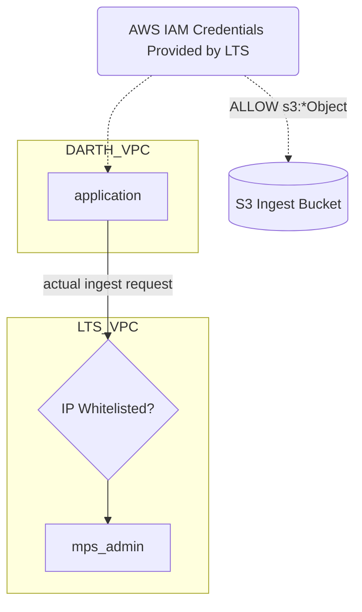
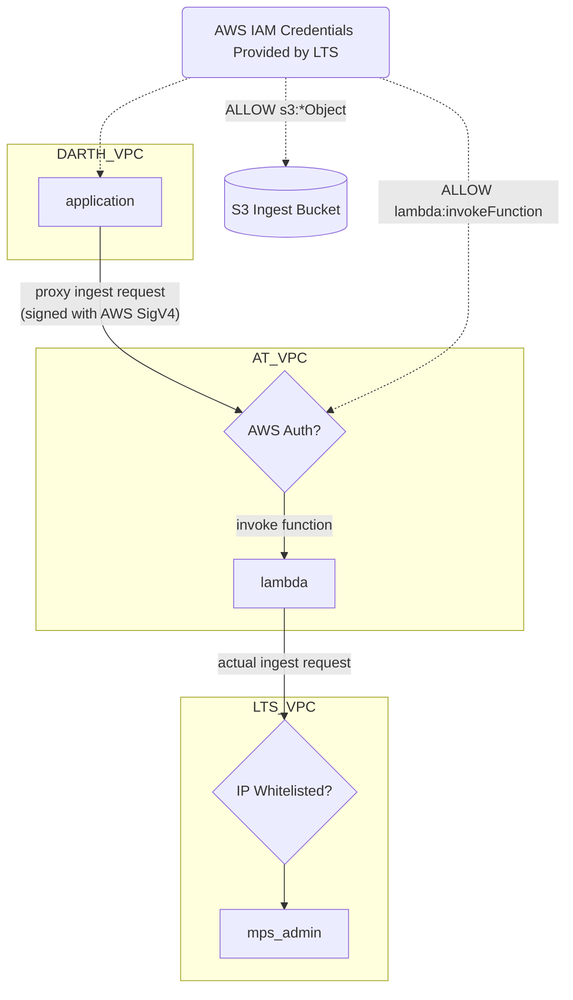

Mockup of the flow we're trying to achieve with a lambda proxying ingest requests between an application and the MPS Admin server. The constraint we're working around is the fact that the application can't be assigned a static IP that can be easily whitelisted and we don't want to run a dedicated server just for the purpose of proxying requests (cost is an issue).

## No Proxy

- `app` sends ingest request direclty to the MPS Admin.
- `app` has a source IP that is whitelisted by MPS Admin.
- `app` has a JWT token to authenticate and authorize the request.
- `app` has AWS credentials (key/secret) to upload to S3 bucket.

## Proxy

- `app` does NOT have a source IP that is whitelisted by MPS Admin, but `lambda` does (because it's in a VPC already whitelisted).
- `lambda` authorizes requests using AWS IAM_AUTH, meaning it must receive a request signed by AWS SigV4.
- `app` would like to use the same AWS IAM credentials (key/secret) used to upload to the S3 bucket to also authenticate with `lambda`. This requires said credentials (e.g. AWS IAM user) to have a policy that allows it to call `lambda:invokeFunction`. The `lambda` itself will also need to have a resource policy that allows that principal to make the request.

## See also

[AWS: Invoking Lambda function URLs](https://docs.aws.amazon.com/lambda/latest/dg/urls-invocation.html)

[AWS: Cross-account policy evaluation logic](https://docs.aws.amazon.com/IAM/latest/UserGuide/reference_policies_evaluation-logic-cross-account.html)